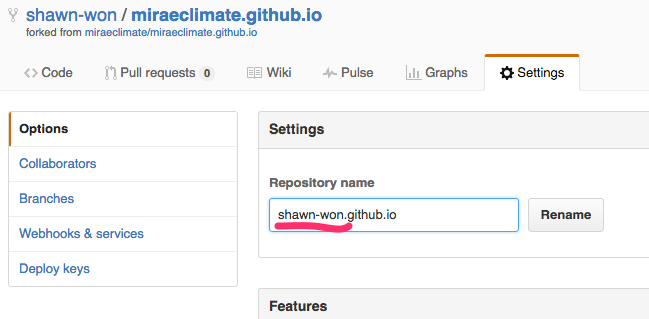
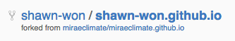
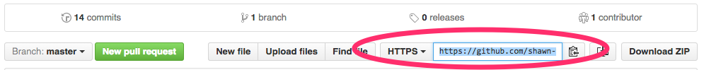
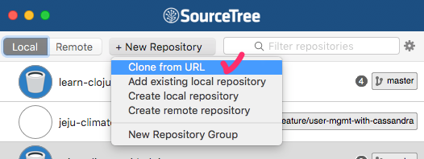

# 홈페이지 개발 작업에 참여하는 방법

1. [http://github.io/miraeclimate/miraeclimate.github.io](https://github.com/miraeclimate/miraeclimate.github.io)로 이동.

1. 아래 그림에서 `Fork` 버튼을 선택.
 

 프로젝트가 자신의 계정으로 Fork 되었다.

1. Settings 탭에서 `Repository name`의 앞부분을 자신의 계정 이름으로 바꾼다. 여기서는 `miraeclimate` 을 `shawn-won`으로 바꾸었다.

 fork된 프로젝트의 모습.

 

1. 그다음 아래 그림의 주소 부분을 클립보드에 복사.
 

1. 이제 자신의 컴퓨터로 위 repository를 clone한다.

 

1. 아래 그림을 참고하여 다음과 같이 입력한다.
 * Source URL: 위에서 복사한 주소
 * Destination Path: 뒤부분 repository 이름은 두고 앞부분을 원하는 디렉토리로 바꾼다.
 * `Clone` 버튼 선택

 
